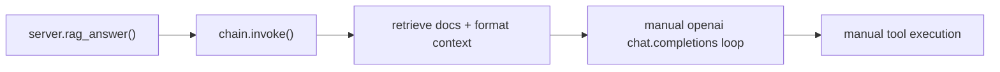
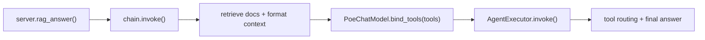

# LangChain ChatModel + AgentExecutor Plan

## Goal

Move from direct `openai` calls in [app/chain.py](c:/Users/belly/Desktop/chatbot/ragchatbot/app/chain.py) to a LangChain-native model invocation with tool binding and AgentExecutor-managed tool flow.

## Current vs Target Structure







## File-by-file Plan

- [app/llm_poe.py](c:/Users/belly/Desktop/chatbot/ragchatbot/app/llm_poe.py)
  - Extend `PoeChatModel` so tool calls are represented as LangChain tool-calling outputs (`AIMessage.tool_calls`) instead of text-only generation.
  - Add support for passing through tool-related kwargs (`tools`, `tool_choice`) in `_generate()`.
  - Keep existing plain text behavior when no tools are requested.
- [app/crypto.py](c:/Users/belly/Desktop/chatbot/ragchatbot/app/crypto.py)
  - Add LangChain tool wrapper(s) for existing `execute_tool()` logic (minimal adapter, no core logic rewrite).
  - Reuse current validation/formatting functions; avoid duplicating API logic.
- [app/chain.py](c:/Users/belly/Desktop/chatbot/ragchatbot/app/chain.py)
  - Keep retrieval block as-is (`_build_retriever`, `format_docs`, non-fatal retrieval).
  - Replace manual `client.chat.completions.create(...)` loop with:
    - LangChain prompt messages construction
    - `PoeChatModel(...).bind_tools(langchain_tools)`
    - Agent + `AgentExecutor.invoke(...)`
  - Keep `_MAX_TOOL_ROUNDS` behavior by mapping to AgentExecutor limits (`max_iterations`).
  - Preserve trace hooks (`record_retrieval`, `record_tool`, `record_llm`) with the new invocation outputs.
- [app/tracing.py](c:/Users/belly/Desktop/chatbot/ragchatbot/app/tracing.py)
  - Ensure trace ingestion accepts AgentExecutor output shape (`output`, `intermediate_steps`) and still records:
    - final answer
    - tool arguments/results
    - timing and token usage when available

## Minimal Target Code Shape (illustrative)

```python
# in chain.py (concept)
llm = PoeChatModel(
    bot_name=settings.poe_bot_name,
    temperature=temperature,
    max_tokens=max_tokens,
)

tools = [check_crypto_price_tool]
llm_with_tools = llm.bind_tools(tools, tool_choice="auto")

agent = create_tool_calling_agent(
    llm=llm_with_tools,
    tools=tools,
    prompt=agent_prompt,
)

executor = AgentExecutor(
    agent=agent,
    tools=tools,
    max_iterations=_MAX_TOOL_ROUNDS,
    return_intermediate_steps=True,
)

result = executor.invoke({"question": question, "memory": memory, "context": context})
answer = result["output"]
```

## Validation Plan

- Functional
  - `/chat` normal Q&A still responds.
  - Tool question (e.g., BTC price) triggers exactly one tool call and returns formatted price.
  - Non-tool question does not invoke tool.
- Observability
  - `/traces` still shows retrieval payloads.
  - Tool calls and arguments/results appear in trace.
  - LLM section includes final response and token usage when provided.
- Safety/Regression
  - Verify retriever failures remain non-fatal (empty context fallback).
  - Confirm `/reload-prompts` still updates temperature/max_tokens applied by the model instance.

## Risk Notes

- Poe compatibility may differ from OpenAI for structured tool-call payload shape; wrapper adaptation in [app/llm_poe.py](c:/Users/belly/Desktop/chatbot/ragchatbot/app/llm_poe.py) is the key risk area.
- If `.bind_tools()` proves incompatible with current Poe model, fallback plan is LangChain Runnable + manual loop (still using `PoeChatModel` for message conversion).

