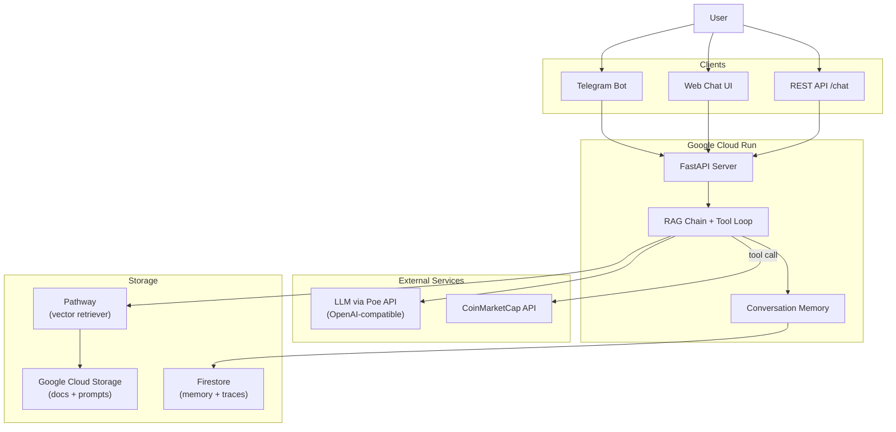

# RAG Chatbot with Telegram Bot

A retrieval-augmented generation (RAG) chatbot that answers questions from a
document knowledge base. Accessible via **Telegram**, a **web chat UI**, or a
plain **REST API** — deployed on **Google Cloud Run**.

---

## Architecture



---

## Key Features

- **RAG pipeline** — retrieves relevant documents from Pathway/FAISS, injects
  them as context, and generates grounded answers.
- **Tool calling** — LLM can call external tools (crypto price lookup) via the
  OpenAI function-calling protocol with a multi-round tool loop.
- **Conversation memory** — per-user rolling summary + recent messages + FAISS
  vector recall of relevant past turns, stored in Firestore.
- **Hot-reloadable prompts** — upload `prompts.yaml` to a GCS bucket and hit
  `/reload-prompts` to update system prompt, temperature, and parameters
  without redeploying.
- **Structured tracing** — every request is traced end-to-end (retrieval, LLM,
  tools, memory, token usage) and written to Firestore for inspection via
  `/traces`.
- **Retrieval test UI** — `/retrieval-test-ui` lets you test vector search
  quality directly in the browser, with no LLM involvement.
- **Multi-channel** — same backend serves Telegram webhook, web chat UI, and
  REST API.

---

## Project Structure

```
ragchatbot/
├── app/
│   ├── chain.py          # RAG chain with tool-calling loop
│   ├── llm_poe.py        # ChatOpenAI factory (Poe endpoint)
│   ├── crypto.py          # CoinMarketCap tool + LangChain @tool
│   ├── memory.py          # Firestore conversation memory + FAISS recall
│   ├── pathway.py         # Pathway vector index with GCS sync
│   ├── prompts.py         # Prompt loading from GCS / local / defaults
│   ├── settings.py        # Environment-based configuration
│   ├── telegram_bot.py    # Telegram webhook handler
│   └── tracing.py         # Structured request tracing to Firestore
├── server/
│   ├── server.py          # FastAPI app (endpoints, lifespan)
│   ├── chat_ui.html       # Web chat interface
│   └── retrieval_test.html# Retrieval quality test page
├── ingest/
│   ├── ingest.py          # Document ingestion entry point
│   ├── loaders.py         # File loaders
│   └── splitters.py       # Text splitters
├── Dockerfile
├── cloudbuild.yaml
├── cloudrun.yaml
└── pyproject.toml
```

---

## How to Run

### Local development

```bash
# 1. Install dependencies
pip install -e .

# 2. Set environment variables (or create .env)
export POE_API_KEY=your_poe_api_key
export TELEGRAM_BOT_TOKEN=your_bot_token
export COINMARKETCAP_API_KEY=your_cmc_key
export FIREBASE_PROJECT_ID=your_project_id

# 3. Ingest documents (optional, if using local FAISS)
python -m ingest.ingest

# 4. Start the server
uvicorn server.server:app --reload --port 8080
```

Then open:
- Web chat: `http://localhost:8080/chat-ui`
- Retrieval test: `http://localhost:8080/retrieval-test-ui`
- API: `POST http://localhost:8080/chat` with `{"question": "...", "user_id": "..."}`

### Deploy to Cloud Run

```bash
# Build and push
gcloud builds submit --config cloudbuild.yaml

# Or manually
docker build -t gcr.io/$PROJECT_ID/ragchatbot .
docker push gcr.io/$PROJECT_ID/ragchatbot
gcloud run deploy ragchatbot \
  --image gcr.io/$PROJECT_ID/ragchatbot \
  --region asia-east2
```

Set secrets (POE_API_KEY, TELEGRAM_BOT_TOKEN, etc.) in the Cloud Run console
or via `cloudrun.yaml`.

---

## Pathway Retriever (Optional)

Pathway runs as an in-process thread that syncs documents from GCS and serves
vector search. This enables live document updates without redeployment.

```bash
# Upload documents to GCS
gsutil -m rsync -r ./data/raw gs://ragchatbot-raw

# Set environment variables
PATHWAY_HOST=0.0.0.0
PATHWAY_PORT=8081
GCS_BUCKET=ragchatbot-raw
```

Pathway starts automatically with the server and periodically syncs new or
changed files from the bucket.

--

---
